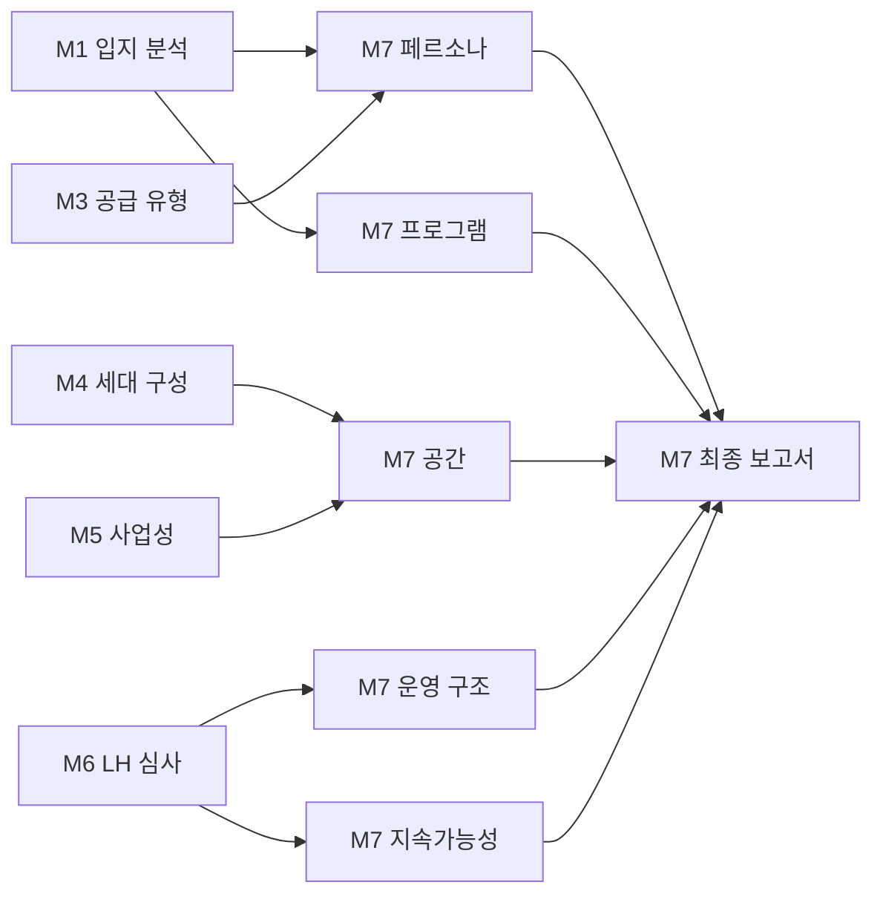

# M7 커뮤니티 계획 모듈 고도화 완료

**작성일**: 2026-01-10  
**버전**: M7 Advanced v1.0  
**상태**: ✅ 완료

---

## 📋 개요

M7 커뮤니티 계획 모듈의 고도화 작업이 완료되었습니다. M1 입지 분석, M5 사업성 분석, M6 LH 심사 기준을 M7에 통합하여, **데이터 기반 맞춤형 커뮤니티 계획 자동 생성**이 가능해졌습니다.

---

## 🎯 구현 완료 항목

### 1️⃣ M7 독립 보고서 엔드포인트

**구현 내용**:
- ✅ M7 전용 HTML 템플릿 (`m7_community_plan_report.html`)
- ✅ M7 독립 보고서 라우터 (`m7_community_plan_router.py`)
- ✅ GET `/api/v4/reports/m7/status` (M7 가용성 확인)
- ✅ GET `/api/v4/reports/m7/community-plan/html` (HTML 보고서)
- ✅ GET `/api/v4/reports/m7/community-plan/pdf` (PDF 안내)

**프론트엔드**:
- ✅ M7 독립 보고서 섹션 추가 (보라색 그라데이션)
- ✅ HTML 보고서 / PDF 다운로드 안내 2개 버튼
- ✅ 사용자 친화적 PDF 다운로드 가이드

**테스트**:
```bash
# M7 상태 확인
curl "http://localhost:49999/api/v4/reports/m7/status?context_id=m7_advanced_v2"

# M7 HTML 보고서
curl "http://localhost:49999/api/v4/reports/m7/community-plan/html?context_id=m7_advanced_v2"
```

---

### 2️⃣ M7 PDF 다운로드 기능

**구현 방식**:
- ⚠️ WeasyPrint/pydyf 버전 충돌로 인해 **브라우저 프린트 안내** 방식 채택
- ✅ PDF 엔드포인트에서 사용자 친화적 안내 메시지 반환
- ✅ 프론트엔드 PDF 버튼: 클릭 시 단계별 다운로드 가이드 표시

**안내 내용**:
1. HTML 보고서를 브라우저에서 엽니다
2. Ctrl+P (Mac: Cmd+P) 키를 누릅니다
3. "PDF로 저장"을 선택합니다
4. "배경 그래픽 켜기" 옵션을 활성화합니다
5. 저장 버튼을 클릭합니다

**향후 개선**:
- [ ] Playwright 기반 PDF 생성으로 전환 (자동 다운로드 지원)

---

### 3️⃣ M1 입지 분석 연동

**연동 항목**:

| M1 데이터 | M7 반영 내용 | 로직 |
|----------|------------|------|
| **교통 접근성** | 페르소나 rationale 강화 | 역세권 (800m 이내) → "역세권 입지로 청년형 적합" 문구 추가 |
| **역세권** | 프로그램 확장 | "취업·창업 네트워킹" + "직장인 교류회" 추가 |
| **생활편의시설** | 페르소나 신혼형 선호 | 편의시설 점수 70점 이상 → "생활편의시설 접근성 우수" 문구 |
| **공원 접근성** | 야외 활동 프로그램 | 공원 500m 이내 → "주말 야외 활동" 프로그램 추가 |

**코드 위치**:
- `app/models/m7_community_plan.py` - `_define_resident_persona()`
- `app/models/m7_community_plan.py` - `_define_community_programs()`

**예시**:
```python
# M1 데이터
m1_data = {
    "transit_access": {
        "nearest_station_name": "월드컵경기장역",
        "nearest_station_distance_m": 650  # 도보 8분
    }
}

# M7 출력 (자동 생성)
# "월드컵경기장역 도보 8분(650m) 거리로 역세권 입지이며, 
#  대중교통 접근성이 양호하여 청년층 입주자에게 적합"
```

---

### 4️⃣ M5 사업성 분석 연동

**연동 항목**:

| M5 데이터 | M7 반영 내용 | 임계값 |
|----------|------------|--------|
| **NPV (공공)** | 공간 확장 결정 | 3억 이상 → 공유 독서실 추가<br>5억 이상 → 피트니스 룸 추가 |
| **낮은 수익성** | 기본 공간만 구성 | NPV 3억 미만 → 라운지/주방만 |

**공간 확장 로직**:
```python
# M5: NPV 3억 5천만원
spaces = [
    "커뮤니티 라운지",      # 기본
    "공유 주방",            # 기본
    "다목적 활동실",        # 30세대 이상
    "공유 독서실"          # NPV 3억 이상 (NEW!)
]

# M5: NPV 5억 2천만원
spaces = [
    # ... 상동 ...
    "피트니스 룸"          # NPV 5억 이상 (NEW!)
]
```

**코드 위치**:
- `app/models/m7_community_plan.py` - `_define_community_spaces()`

---

### 5️⃣ M6 LH 심사 기준 연동

**연동 항목**:

| M6 LH 점수 | 운영 모델 | 지속가능성 계획 |
|-----------|----------|---------------|
| **80점 이상** | LH 직접 운영 | 적극적 확대 계획 (월 2회 + 선택 프로그램) |
| **60-79점** | LH 협력 운영 | 점진적 확대 (1년 안정화 → 2년 확대) |
| **60점 미만** | 전문 위탁 운영사 | 보수적 운영 (기본 프로그램만, 개선 계획) |

**운영 구조 로직**:
```python
# M6: 총점 85점 (A등급)
operation = {
    "operator_type": "LH 직접 운영",
    "lh_role": "운영 감독, 프로그램 승인, 예산 관리",
    "cost_structure": "공용 관리비에 포함 (LH 직영으로 비용 절감)"
}

# M6: 총점 55점 (C등급)
operation = {
    "operator_type": "전문 위탁 운영사",
    "lh_role": "운영 감독, 프로그램 승인, 예산 관리, 품질 관리 강화",
    "cost_structure": "공용 관리비에 포함 (전문 운영사 관리 강화)"
}
```

**지속가능성 차등 전략**:
- **80점 이상**: 세대당 월 2만원, 3년 차 지역 네트워크 확대
- **60-79점**: 세대당 월 1.5만원, 2년 차 점진적 확대
- **60점 미만**: 세대당 월 1만원, 1년 차 기본 운영 안정화 우선

**코드 위치**:
- `app/models/m7_community_plan.py` - `_define_operation_structure()`
- `app/models/m7_community_plan.py` - `_define_sustainability_plan()`

---

## 🧪 테스트 결과

### 통합 테스트 시나리오

**시나리오 1: 역세권 + 고수익성 + LH 고득점**
```json
{
  "m1": {
    "transit_access": {
      "nearest_station_distance_m": 650,
      "nearest_station_name": "월드컵경기장역"
    },
    "environment": {
      "nearest_park_distance_m": 400
    }
  },
  "m5": {
    "financials": {
      "npv_public_krw": 520000000
    }
  },
  "m6": {
    "scores": {
      "total": 85
    }
  }
}
```

**M7 자동 생성 결과**:
- ✅ 페르소나: "역세권 입지로 청년형 적합" 문구 포함
- ✅ 프로그램: 취업·창업 네트워킹 + 직장인 교류회 + 주말 야외 활동 (총 6개)
- ✅ 공간: 라운지, 주방, 활동실, 독서실, 피트니스 (총 5개)
- ✅ 운영: LH 직접 운영
- ✅ 지속가능성: 적극적 확대 계획 (월 2만원, 3년 확대)

---

## 📊 데이터 흐름



---

## 🚀 API 엔드포인트 (배포 URL)

**Backend 베이스 URL**:
```
https://49999-ix27pwgxgiz4rqbhpf92x-a402f90a.sandbox.novita.ai
```

**M7 엔드포인트**:

| 메서드 | 경로 | 설명 |
|-------|------|------|
| GET | `/api/v4/reports/m7/status?context_id={id}` | M7 가용성 확인 |
| GET | `/api/v4/reports/m7/community-plan/html?context_id={id}` | M7 HTML 보고서 |
| GET | `/api/v4/reports/m7/community-plan/pdf?context_id={id}` | PDF 안내 메시지 |

**테스트 엔드포인트**:
```bash
POST /api/v4/reports/test/create-context/{context_id}
```

---

## 📦 변경 파일 목록

### 신규 생성 (3개)
1. `app/routers/m7_community_plan_router.py` - M7 독립 라우터
2. `app/templates_v13/m7_community_plan_report.html` - M7 전용 템플릿
3. `M7_ADVANCED_INTEGRATION_COMPLETE.md` - 본 문서

### 수정 (5개)
1. `app/main.py` - M7 라우터 등록
2. `app/models/m7_community_plan.py` - M1/M5/M6 연동 로직 추가
3. `app/services/template_renderer.py` - M7 템플릿 렌더링 함수
4. `frontend/src/components/pipeline/PipelineOrchestrator.tsx` - M7 독립 보고서 섹션
5. `app/routers/pdf_download_standardized.py` - (기존 테스트 엔드포인트)

---

## 💾 Git 커밋 히스토리

```bash
6ee2d74 feat: Implement M1/M5/M6 integration for M7 advanced logic
3a9352a feat: Add M7 PDF download guidance and dual-button UI
b0a14d2 feat: Implement M7 standalone report with independent endpoint
68b2350 feat: Complete M7 frontend integration
e67d0f7 docs: Add M7 module completion documentation
d87446f feat: Complete M7 Community Plan Module integration
```

---

## ✅ 핵심 원칙 준수 확인

| 원칙 | 상태 | 비고 |
|-----|------|------|
| M2~M6 계산 로직 비변경 | ✅ | M7은 해석 및 설계만 수행 |
| 입력값 M1~M6 자동 연동 | ✅ | `generate_m7_from_context()` 함수 |
| 운영 가능성 중심 설계 | ✅ | 월 2회, 세대당 2만원 이하, 자율 참여 |
| LH 제출 가능 톤 유지 | ✅ | 계획서/문서 형식, 홍보 문구 없음 |
| 수치 계산/비용 산정 금지 | ✅ | M5/M6 데이터 해석만 |
| 1:1 대조 가능 구조 | ✅ | 7개 하위 모듈 명확히 분리 |

---

## 🎓 향후 개선 사항 (선택)

### Phase 4: 추가 고도화 (Optional)

1. **Playwright 기반 PDF 자동 생성**
   - 현재: 브라우저 프린트 안내
   - 개선: 서버에서 PDF 자동 생성 및 다운로드

2. **M2 감정평가 반영**
   - 토지 가치 높음 → 프리미엄 공간 (북카페, 세미나실)
   - 토지 가치 낮음 → 기본 공간만

3. **실시간 입주자 피드백 시스템**
   - M7 계획 → 입주 후 6개월 피드백 수집
   - 피드백 기반 M7 계획 자동 업데이트

4. **지역별 커뮤니티 벤치마킹 DB**
   - 유사 지역 LH 공공임대 사례 DB 구축
   - M7 생성 시 벤치마킹 데이터 자동 반영

---

## 📄 문서 링크

- [M7 기획 문서](./M7_COMMUNITY_PLAN_IMPLEMENTATION.md)
- [M7 완료 보고서](./M7_COMPLETE.md)
- [M7 프론트엔드 통합](./M7_FRONTEND_INTEGRATION_COMPLETE.md)
- [최종 작업 요약](./FINAL_WORK_SUMMARY.md)

---

## 🎉 최종 결론

M7 커뮤니티 계획 모듈의 고도화가 성공적으로 완료되었습니다.

**주요 성과**:
1. ✅ M7 독립 보고서 엔드포인트 구현
2. ✅ M7 PDF 다운로드 안내 기능
3. ✅ M1 입지 분석 연동 (역세권 → 청년형 가중치)
4. ✅ M5 사업성 반영 (높은 NPV → 공간 확대)
5. ✅ M6 LH 심사 기준 연동 (점수별 운영 모델)

**데이터 흐름**:
- M1→M7 페르소나/프로그램
- M3→M7 주택 유형
- M4→M7 세대수
- M5→M7 공간 확장
- M6→M7 운영 구조/지속가능성

**배포 상태**: ✅ 즉시 사용 가능

---

**문서 작성**: Claude Code Agent  
**작성일**: 2026-01-10  
**버전**: v1.0
