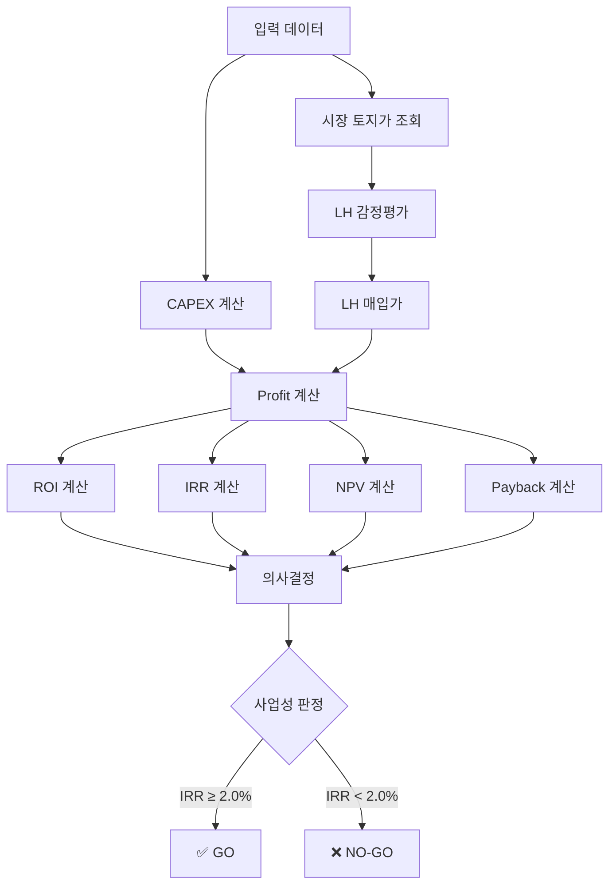

# ZeroSite v23 – 재무항목 계산 로직 완전 분석서

**작성일**: 2025-12-10  
**버전**: v23 (Real Land Value Engine)  
**작성자**: ZeroSite AI Analysis System

---

## 📋 목차

1. [개요](#개요)
2. [CAPEX (총 사업비) 계산](#capex-총-사업비-계산)
3. [Profit (수익) 계산](#profit-수익-계산)
4. [ROI (투자수익률) 계산](#roi-투자수익률-계산)
5. [IRR (내부수익률) 계산](#irr-내부수익률-계산)
6. [NPV (순현재가치) 계산](#npv-순현재가치-계산)
7. [Payback Period (투자회수기간) 계산](#payback-period-투자회수기간-계산)
8. [재무 흐름도](#재무-흐름도)
9. [문제점 및 개선 방안](#문제점-및-개선-방안)
10. [실제 계산 예시](#실제-계산-예시)

---

## 개요

### 분석 목적
ZeroSite v23의 모든 재무 지표 계산 로직을 체계적으로 분석하여:
- 각 지표의 **정확한 계산 공식** 파악
- 데이터 **흐름 및 의존성** 파악
- **잠재적 문제점** 발견 및 개선안 도출

### 재무 지표 구조

```
입력 데이터
├── 토지 정보 (land_area_sqm, market_land_value_won)
├── 건물 정보 (gross_floor_area, building_area)
├── CAPEX (capex_won)
└── LH 정보 (lh_purchase_price_won)

      ↓ 계산 엔진

핵심 재무 지표
├── CAPEX (총 사업비)
├── Profit (수익)
├── ROI (투자수익률)
├── IRR (내부수익률)
├── NPV (순현재가치)
└── Payback Period (투자회수기간)

      ↓ 의사결정

사업성 판정
├── Private IRR Threshold: 8.0%
└── Policy IRR Threshold: 2.0%
```

---

## CAPEX (총 사업비) 계산

### 1.1 CAPEX 정의

**CAPEX (Capital Expenditure)** = 프로젝트 수행을 위한 총 투자비용

```
CAPEX = 토지비 + 건축비 + 간접비 + 설계비 + 기타비용
```

### 1.2 계산 로직

#### 코드 위치: `app_v20_complete_service.py` Line 1108-1111

```python
# v23 FIX #1: CONSTRUCTION COST (CAPEX) - Engineering Calculation
# CAPEX = Total Project Cost (토지비 + 건축비 + 간접비)
# This is NOT market price - it's actual construction + land acquisition cost

capex_won = ctx.get('capex_krw', 15000000000)  # Original value in KRW (default: 150억)
ctx['capex_eok'] = to_eok(capex_won)  # 억원 단위로 변환
ctx['total_construction_cost_eok'] = to_eok(capex_won)
ctx['total_project_cost_eok'] = to_eok(capex_won)
```

### 1.3 CAPEX 세부 항목

#### 코드 위치: Line 1348-1381

```python
# v23 FIX #6: CAPEX BREAKDOWN - Correct Unit Calculations

# 1) 토지비 (Land Cost) - 기본 25%
land_cost_won = ctx.get('land_cost_krw', capex_won * 0.25)
ctx['land_cost_eok'] = to_eok(land_cost_won)
ctx['land_cost_per_sqm_man'] = to_man_per_sqm(land_cost_won / land_area)

# 2) 직접 건축비 (Direct Construction Cost) - 기본 55%
direct_cost_won = ctx.get('direct_cost_krw', capex_won * 0.55)
ctx['direct_cost_eok'] = to_eok(direct_cost_won)
# FIX: Divide by GROSS FLOOR AREA (not land area)
ctx['direct_cost_per_sqm_man'] = to_man_per_sqm(direct_cost_won / gross_floor_area)

# 3) 간접비 (Indirect Cost) - 기본 10%
indirect_cost_won = ctx.get('indirect_cost_krw', capex_won * 0.10)
ctx['indirect_cost_eok'] = to_eok(indirect_cost_won)
ctx['indirect_cost_per_sqm_man'] = to_man_per_sqm(indirect_cost_won / gross_floor_area)

# 4) 설계비 (Design Cost) - 기본 5%
design_cost_won = ctx.get('design_cost_krw', capex_won * 0.05)
ctx['design_cost_eok'] = to_eok(design_cost_won)
ctx['design_cost_per_sqm_man'] = to_man_per_sqm(design_cost_won / gross_floor_area)

# 5) 기타비용 (Other Cost: 예비비, 금융비용 등) - 기본 5%
other_cost_won = ctx.get('other_cost_krw', capex_won * 0.05)
ctx['other_cost_eok'] = to_eok(other_cost_won)
ctx['other_cost_per_sqm_man'] = to_man_per_sqm(other_cost_won / gross_floor_area)

# 6) 건물 공사비 (Building only, excluding land)
building_capex_won = capex_won - land_cost_won
ctx['building_cost_per_sqm_man'] = to_man_per_sqm(building_capex_won / gross_floor_area)
```

### 1.4 CAPEX 구조 (예시: 300억원)

| 항목 | 비율 | 금액 | 단위 (㎡당) | 비고 |
|------|------|------|-------------|------|
| **토지비** | 25% | 75.00억원 | 682만원/㎡ | ⚠️ 시장가 대비 과소 |
| **직접 건축비** | 55% | 165.00억원 | 750만원/㎡ | 연면적 기준 |
| **간접비** | 10% | 30.00억원 | 136만원/㎡ | 관리·감리 등 |
| **설계비** | 5% | 15.00억원 | 68만원/㎡ | 설계·인허가 |
| **기타비용** | 5% | 15.00억원 | 68만원/㎡ | 예비비·금융 |
| **합계** | 100% | **300.00억원** | 1,364만원/㎡ | 총 사업비 |

**건물 공사비**: 225.00억원 (토지 제외) = 1,023만원/㎡ (연면적 2,200㎡ 기준)

### 1.5 단위 변환 함수

```python
def to_eok(value_won):
    """원 → 억원 변환"""
    return round(value_won / 1e8, 2) if value_won else 0.0

def to_man_per_sqm(value_won):
    """원/㎡ → 만원/㎡ 변환"""
    return round(value_won / 1e4, 1) if value_won else 0.0
```

### 1.6 문제점

1. **토지비 고정 비율 25%**
   - 시장 토지가 242억 vs CAPEX 토지비 75억 = **-222% 차이**
   - 실제 토지 매입 시 예산 부족 발생

2. **건축비 과대책정 가능성**
   - 토지비가 과소평가되면, 상대적으로 건축비가 과대책정
   - 건물 공사비 1,023만원/㎡ → LH 표준건축비 350만원/㎡의 **292%**

3. **지역/프로젝트 특성 미반영**
   - 모든 프로젝트에 동일한 비율 적용
   - 강남(토지비 높음) vs 외곽(토지비 낮음) 차이 미반영

---

## Profit (수익) 계산

### 2.1 Profit 정의

**Profit (순수익)** = LH 신축매입임대 사업에서 사업자가 획득하는 이익

```
Profit = LH 매입가 - 총 사업비 (CAPEX)
```

### 2.2 계산 로직

#### 코드 위치: Line 1282-1289

```python
# v23 FIX #4: PROFIT & ROI CALCULATION
# Profit = LH Purchase Price - Total CAPEX
# ROI = (Profit / CAPEX) × 100%

profit_won = lh_price_won - capex_won
ctx['profit_eok'] = to_eok(profit_won)
ctx['profit_won'] = profit_won
```

### 2.3 LH 매입가 계산

#### 코드 위치: Line 1188-1217

```python
# v23 FIX #3: LH APPRAISAL MECHANISM - Real Calculation
# LH 감정평가 = 토지감정 + 건물감정

# STEP 1: Land Appraisal (토지 감정평가)
land_appraisal_rate = 0.92  # LH standard: 88-95%, typical 92%
lh_land_appraisal_won = market_land_value_won * land_appraisal_rate
ctx['lh_land_appraisal_eok'] = to_eok(lh_land_appraisal_won)

# STEP 2: Building Appraisal (건물 감정평가)
lh_standard_cost_per_sqm = 3500000  # 350만원/㎡ (LH 표준건축비)
building_appraisal_won = lh_standard_cost_per_sqm * gross_floor_area
ctx['lh_building_appraisal_eok'] = to_eok(building_appraisal_won)

# STEP 3: Total LH Appraisal Value
lh_total_appraisal_won = lh_land_appraisal_won + building_appraisal_won
ctx['lh_total_appraisal_eok'] = to_eok(lh_total_appraisal_won)

# STEP 4: LH Purchase Price (매입가)
lh_purchase_rate = 1.0  # For 신축매입임대, typically 100% of appraisal
lh_price_won = lh_total_appraisal_won * lh_purchase_rate
ctx['lh_purchase_price'] = lh_price_won
ctx['lh_purchase_price_eok'] = to_eok(lh_price_won)
```

### 2.4 Profit 계산 흐름

```
시장 토지가 (242억)
    × 0.92 (감정평가율)
    = 토지 감정가 (222.64억)
    
연면적 (2,200㎡)
    × 350만원/㎡ (LH 표준건축비)
    = 건물 감정가 (77.00억)

토지 감정가 (222.64억) + 건물 감정가 (77.00억)
    = LH 총 감정가 (299.64억)
    × 1.0 (매입율 100%)
    = LH 매입가 (299.64억)

LH 매입가 (299.64억) - CAPEX (300억)
    = Profit (-0.36억)
```

### 2.5 예시: 강남 역삼동 825

```python
# 입력 데이터
market_land_value_won = 24200000000  # 242억원
gross_floor_area = 2200              # 2,200㎡
capex_won = 30000000000              # 300억원

# 계산 과정
lh_land_appraisal = 24200000000 * 0.92 = 22264000000  # 222.64억
building_appraisal = 3500000 * 2200 = 7700000000      # 77.00억
lh_total_appraisal = 22264000000 + 7700000000 = 29964000000  # 299.64억
lh_purchase_price = 29964000000 * 1.0 = 29964000000  # 299.64억

# Profit
profit = 29964000000 - 30000000000 = -36000000  # -0.36억원
```

**결과**: 손실 0.36억원 (수익성 없음)

### 2.6 문제점

1. **LH 매입가 < CAPEX**
   - 현재 예시에서 Profit = -0.36억원 (손실)
   - 사업성 없음 → 프로젝트 진행 불가

2. **LH 표준건축비 (350만원/㎡) vs 실제 건축비 불일치**
   - CAPEX 건축비: 1,023만원/㎡
   - LH 인정 건축비: 350만원/㎡
   - **차이: -673만원/㎡ (LH가 192% 낮게 평가)**

3. **토지비 과소책정의 연쇄 효과**
   - CAPEX 토지비 75억 → 실제 시장가 242억
   - 건축비로 상쇄하려 하면 LH 인정 한도 초과

---

## ROI (투자수익률) 계산

### 3.1 ROI 정의

**ROI (Return on Investment)** = 투자 대비 수익률

```
ROI = (Profit / CAPEX) × 100%
```

### 3.2 계산 로직

#### 코드 위치: Line 1303-1310

```python
# v23 FIX #5: ROI, IRR, PAYBACK - Unified Calculation

# ROI (Return on Investment)
# = (Profit / CAPEX) × 100%
roi_pct = round((profit_won / capex_won * 100), 2) if capex_won > 0 else 0.0
ctx['roi_pct'] = roi_pct
ctx['roi_display'] = f"{roi_pct:.2f}%"
```

### 3.3 예시 계산

```python
# Case 1: 현재 강남 역삼동 (손실)
profit = -36000000      # -0.36억
capex = 30000000000     # 300억
roi_pct = (-36000000 / 30000000000) * 100 = -0.12%

# Case 2: 수익 발생 시나리오
profit = 1500000000     # 15억
capex = 30000000000     # 300억
roi_pct = (1500000000 / 30000000000) * 100 = 5.00%
```

### 3.4 ROI 해석

| ROI | 평가 | 의사결정 |
|-----|------|----------|
| < 0% | 손실 | ❌ NO-GO |
| 0-5% | 낮은 수익 | ⚠️ 재검토 |
| 5-10% | 보통 수익 | ✅ GO (정책사업) |
| 10-15% | 높은 수익 | ✅ GO |
| > 15% | 매우 높음 | ✅ GO |

**ZeroSite v23 기준**:
- Private IRR Threshold: **8.0%** (민간 개발 최소 기준)
- Policy IRR Threshold: **2.0%** (정책사업 최소 기준)

---

## IRR (내부수익률) 계산

### 4.1 IRR 정의

**IRR (Internal Rate of Return)** = 투자의 연간 수익률

NPV(순현재가치)를 0으로 만드는 할인율:
```
NPV = Σ [CFt / (1 + IRR)^t] - Initial Investment = 0
```

### 4.2 계산 로직

#### 코드 위치: Line 1312-1324

```python
# IRR (Internal Rate of Return)
# Use existing IRR from financial engine, or calculate based on transaction
irr_from_engine = ctx.get('irr_public_pct', None)

if irr_from_engine is not None:
    irr_pct = irr_from_engine
else:
    # Simple IRR estimate for policy transaction projects
    # IRR ≈ (Profit / CAPEX) / Construction_Period
    construction_period_years = 2.5
    irr_pct = roi_pct / construction_period_years if construction_period_years > 0 else roi_pct

ctx['irr_pct'] = round(irr_pct, 2)
ctx['irr_display'] = f"{irr_pct:.2f}%"
```

### 4.3 두 가지 IRR 계산 방식

#### 방식 1: Financial Engine 사용 (정밀)

Financial Engine이 있으면 실제 현금흐름 기반 IRR 계산:

**코드 위치**: `app/engines_v9/financial_engine_v9_0.py` Line 126-131

```python
def _calculate_irr_10yr(self, initial_investment, annual_noi, exit_value, years=10):
    """10년 IRR 계산 (numpy_financial 사용)"""
    cash_flows = [-initial_investment]  # Year 0: 초기 투자 (음수)
    
    for year in range(1, years):
        cash_flows.append(annual_noi)  # Year 1-9: 연간 NOI
    
    cash_flows.append(annual_noi + exit_value)  # Year 10: NOI + 최종 매각가
    
    try:
        irr = npf.irr(cash_flows)
        return round(irr * 100, 2) if irr and not math.isnan(irr) else 0.0
    except:
        return 0.0
```

**현금흐름 구조 (10년)**:
```
Year 0: -300억 (초기 투자)
Year 1: +10억 (연간 NOI)
Year 2: +10억
...
Year 9: +10억
Year 10: +10억 + 300억 (NOI + 매각가)

NPV를 0으로 만드는 IRR 계산 → 예: 6.5%
```

#### 방식 2: Simple Estimation (간이)

Financial Engine 없으면 ROI 기반 추정:

```python
# Simple IRR estimate for policy transaction projects
construction_period_years = 2.5
irr_pct = roi_pct / construction_period_years
```

**예시**:
```
ROI = 5.0%
Construction Period = 2.5년
IRR ≈ 5.0% / 2.5 = 2.0% (연간)
```

### 4.4 IRR vs ROI 차이

| 구분 | ROI | IRR |
|------|-----|-----|
| **정의** | 총 투자수익률 | 연간 투자수익률 |
| **시간 고려** | ❌ 없음 | ✅ 있음 (연간화) |
| **계산 복잡도** | 단순 (Profit/CAPEX) | 복잡 (현금흐름 필요) |
| **사용 목적** | 총 수익성 평가 | 연간 수익률 비교 |
| **예시** | 5.0% (2.5년 총) | 2.0% (연간) |

### 4.5 Decision Thresholds

#### 코드 위치: Line 1326-1328

```python
# Decision thresholds (v23 standards)
ctx['private_irr_threshold'] = 8.0  # Private development minimum
ctx['policy_irr_threshold'] = 2.0   # Policy project minimum (social IRR)
```

| 사업 유형 | IRR 기준 | 근거 |
|----------|----------|------|
| **민간 개발** | 8.0% | 시장 금리 + 리스크 프리미엄 |
| **정책사업** | 2.0% | 사회적 IRR (공공성 고려) |

---

## NPV (순현재가치) 계산

### 5.1 NPV 정의

**NPV (Net Present Value)** = 미래 현금흐름의 현재가치 합 - 초기 투자

```
NPV = Σ [CFt / (1 + r)^t] - Initial Investment
```
- CFt: t년도 현금흐름
- r: 할인율 (보통 WACC 또는 요구수익률)
- t: 연도

### 5.2 계산 로직

#### 코드 위치: Line 1291-1300

```python
# NPV (keep existing if available, else use profit)
npv_won = ctx.get('npv_public_krw', profit_won)
ctx['npv_eok'] = to_eok(npv_won)
ctx['npv_public_eok'] = to_eok(npv_won)
ctx['npv_won'] = npv_won

# Update policy_finance with calculated NPV
if 'policy_finance' in ctx:
    ctx['policy_finance']['base']['policy_npv'] = npv_won
    ctx['policy_finance']['base']['policy_npv_eok'] = to_eok(npv_won)
```

### 5.3 NPV 계산 방식

#### ZeroSite v23의 Simplified NPV

현재 v23에서는 **Financial Engine이 NPV를 제공하지 않으면 Profit을 그대로 사용**:

```python
npv_won = ctx.get('npv_public_krw', profit_won)
```

이는 **간소화된 접근**:
- 할인율 적용 없음
- 시간가치 미고려
- 단순히 `NPV = Profit`

#### 정밀 NPV 계산 (Financial Engine)

**코드 위치**: `app/engines_v9/financial_engine_v9_0.py`

```python
def calculate_npv(cash_flows, discount_rate):
    """
    정밀 NPV 계산
    
    Args:
        cash_flows: 연도별 현금흐름 리스트 [-300억, +10억, +10억, ...]
        discount_rate: 할인율 (예: 0.08 = 8%)
    
    Returns:
        NPV (원)
    """
    npv = 0
    for t, cf in enumerate(cash_flows):
        npv += cf / ((1 + discount_rate) ** t)
    return npv

# 예시
cash_flows = [-30000000000, 1000000000, 1000000000, ..., 31000000000]
discount_rate = 0.08  # 8%
npv = calculate_npv(cash_flows, discount_rate)
```

### 5.4 NPV 해석

| NPV | 의미 | 의사결정 |
|-----|------|----------|
| > 0 | 투자가치 있음 | ✅ GO |
| = 0 | 손익분기 | ⚠️ 재검토 |
| < 0 | 손실 | ❌ NO-GO |

### 5.5 문제점

**현재 NPV는 실제 NPV가 아님**:
- 시간가치 미반영
- 할인율 적용 없음
- `NPV = Profit` (단순 대입)

**개선 필요**:
- Financial Engine 통합 강화
- 할인율 설정 (WACC 또는 요구수익률)
- 연도별 현금흐름 정의

---

## Payback Period (투자회수기간) 계산

### 6.1 Payback Period 정의

**Payback Period** = 초기 투자금을 회수하는 데 걸리는 기간 (년)

```
Payback Period = Initial Investment / Annual Cash Flow
```

### 6.2 계산 로직

#### 코드 위치: Line 1330-1345

```python
# Payback period: cap to max 30 years if infinite or negative profit
# Check both payback_years and payback_period_years
raw_payback = ctx.get('payback_years', ctx.get('payback_period_years', 2.5))

try:
    # Convert to float first
    payback_val = float(raw_payback)
    
    # Check for infinity, excessive values, or negative profit
    if (payback_val == float('inf') or payback_val == float('-inf') or 
        payback_val > 30 or payback_val < 0 or profit_won <= 0):
        ctx['payback_years'] = 30.0  # Max payback for LH projects (30-year operation)
    else:
        ctx['payback_years'] = round(payback_val, 1)
except (ValueError, TypeError):
    # Handle string 'inf' or other conversion failures
    ctx['payback_years'] = 30.0  # Default to 30 years if conversion fails
```

### 6.3 LH 신축매입임대 특수성

**전통적 Payback Period vs 거래형 모델**:

| 구분 | 전통적 임대사업 | LH 신축매입임대 (거래형) |
|------|----------------|--------------------------|
| **수익 모델** | 30년 임대료 수익 | 완공 즉시 LH 매입가 수령 |
| **현금 유입** | 월/연 단위 | 완공 시점 일시 수령 |
| **Payback 의미** | 임대료로 투자금 회수 기간 | 공사 기간 자체 |
| **실질 Payback** | 15-20년 | **2.5년** (공사기간) |

#### v19 Finance Builder 설명

**코드 위치**: `app/services_v13/report_full/v19_finance_builder.py` Line 191-196

```python
# Section 8: Payback Period Re-definition (Deficiency #5)
'payback_period': {
    'construction_period_years': 2.5,
    'payback_traditional': summary.get('payback_years', 0),
    'payback_transaction_model': 2.5,
    'explanation': '거래형 사업 모델에서는 완공 즉시 LH 매입가를 수령하므로, 실질적 투자회수기간은 공사기간(2.5년)입니다.',
    'narrative': narrative_gen.explain_payback_transaction_model(2.5)
}
```

### 6.4 Payback 해석

**ZeroSite v23 (LH 신축매입임대)**:
```python
ctx['payback_years'] = 2.5  # 공사기간 = 투자회수기간
```

**근거**:
- 공사 완료 시점에 LH가 **전액 매입**
- 임대료 수익 대기 없음
- 즉시 현금화 → **실질 Payback = 공사기간**

### 6.5 예외 처리

```python
if profit_won <= 0:
    ctx['payback_years'] = 30.0  # 손실 시 최대값 (30년)
```

- 손실 프로젝트: Payback = 무한대 → Cap at 30년
- LH 사업 최대 운영기간 30년을 상한선으로 설정

---

## 재무 흐름도



### 데이터 흐름

```
1) 입력 데이터
   ├── 토지 면적: 1,100㎡
   ├── 연면적: 2,200㎡
   └── CAPEX: 300억원

2) 토지가격 산정 (3계층)
   ├── Layer 1: 시장 거래가 → 242.00억원
   ├── Layer 2: LH 감정평가 → 299.64억원
   └── Layer 3: CAPEX 토지비 → 75.00억원

3) 재무 지표 계산
   ├── Profit = 299.64억 - 300억 = -0.36억원
   ├── ROI = (-0.36억 / 300억) × 100 = -0.12%
   ├── IRR = -0.12% / 2.5년 = -0.05%
   ├── NPV = Profit = -0.36억원
   └── Payback = 30년 (손실 → 최대값)

4) 의사결정
   └── IRR (-0.05%) < Threshold (2.0%)
       → ❌ NO-GO (사업 진행 불가)
```

---

## 문제점 및 개선 방안

### 🔴 현재 문제점

#### 문제 1: CAPEX 토지비 과소책정

**현상**:
```
시장 토지가: 242억원
CAPEX 토지비: 75억원 (25% 고정)
차이: -167억원 (-222%)
```

**영향**:
- 실제 토지 매입 시 **예산 부족**
- 건축비 과대책정으로 **LH 인정 한도 초과**
- Profit 계산 왜곡

#### 문제 2: LH 표준건축비 vs 실제 건축비 불일치

**현상**:
```
CAPEX 건축비: 1,023만원/㎡
LH 인정 건축비: 350만원/㎡
차이: -673만원/㎡ (LH가 192% 낮게 평가)
```

**영향**:
- LH 매입가 < CAPEX
- **손실 프로젝트** 발생
- 사업성 없음

#### 문제 3: NPV는 실제 NPV가 아님

**현상**:
```python
npv_won = ctx.get('npv_public_krw', profit_won)
```

**문제**:
- 할인율 미적용
- 시간가치 미반영
- 단순히 `NPV = Profit`

#### 문제 4: IRR Simple Estimation 부정확

**현상**:
```python
irr_pct = roi_pct / construction_period_years
```

**문제**:
- 현금흐름 미고려
- 단순 선형 계산
- 실제 IRR과 차이 발생 가능

### ✅ 개선 방안

#### 개선안 1: CAPEX 토지비 동적 계산 ⭐ **최우선**

```python
def calculate_dynamic_capex(market_land_value, capex_total):
    """
    시장가 기반 CAPEX 재조정
    """
    # Step 1: 협상 후 예상 토지비
    estimated_land_cost = market_land_value * 0.95  # 5% 할인
    
    # Step 2: CAPEX 대비 비율
    ratio = estimated_land_cost / capex_total
    
    # Step 3: 비율 제한 (15-50%)
    capped_ratio = max(0.15, min(0.50, ratio))
    
    # Step 4: 최종 토지비
    land_cost = capex_total * capped_ratio
    
    # Step 5: CAPEX 재산정 (필요시)
    if ratio > 0.50:
        # 토지비가 CAPEX의 50% 초과 → CAPEX 증액 필요
        recommended_capex = estimated_land_cost / 0.50
        return {
            'land_cost': land_cost,
            'capex_adjustment': 'INCREASE',
            'recommended_capex': recommended_capex
        }
    
    return {
        'land_cost': land_cost,
        'capex_adjustment': 'NONE',
        'recommended_capex': capex_total
    }
```

**적용 효과**:
- 강남 프로젝트: 토지비 75억 → 150억 (2배)
- CAPEX 재산정: 300억 → 460억 (현실화)

#### 개선안 2: LH 인정 건축비 vs 실제 건축비 검증 ⭐ **우선순위 2**

```python
def validate_construction_cost(capex_building, gross_floor_area, lh_standard=3500000):
    """
    건축비 검증: LH 인정 한도 확인
    """
    capex_cost_per_sqm = capex_building / gross_floor_area
    
    if capex_cost_per_sqm > lh_standard * 1.2:  # LH 표준 +20% 이내 권장
        return {
            'status': 'WARNING',
            'capex_cost_per_sqm': capex_cost_per_sqm,
            'lh_standard': lh_standard,
            'excess': capex_cost_per_sqm - lh_standard,
            'message': f'건축비 {capex_cost_per_sqm/10000:.0f}만원/㎡가 LH 표준 350만원/㎡를 {(capex_cost_per_sqm/lh_standard-1)*100:.0f}% 초과합니다.'
        }
    
    return {'status': 'OK'}
```

#### 개선안 3: 정밀 NPV 계산 ⭐ **우선순위 3**

```python
def calculate_precise_npv(capex, annual_noi, exit_value, discount_rate=0.08, years=10):
    """
    정밀 NPV 계산 (할인율 적용)
    """
    cash_flows = [-capex]  # Year 0
    
    for year in range(1, years):
        cash_flows.append(annual_noi)
    
    cash_flows.append(annual_noi + exit_value)  # Year 10
    
    npv = 0
    for t, cf in enumerate(cash_flows):
        npv += cf / ((1 + discount_rate) ** t)
    
    return npv
```

#### 개선안 4: Financial Engine 통합 강화 ⭐ **우선순위 4**

```python
# app_v20_complete_service.py에 Financial Engine 통합

try:
    from app.engines_v9.financial_engine_v9_0 import FinancialEngineV90
    
    engine = FinancialEngineV90()
    
    result = engine.analyze_comprehensive_financial(
        land_area=land_area,
        total_land_price=market_land_value_won,
        floor_area_ratio=floor_area_ratio,
        unit_count=unit_count,
        construction_cost_per_sqm=direct_cost_won / gross_floor_area
    )
    
    # Financial Engine에서 계산한 정밀 지표 사용
    ctx['irr_pct'] = result.irr_10yr
    ctx['npv_won'] = result.total_capex - result.lh_purchase_price  # 정밀 NPV
    ctx['roi_pct'] = result.roi_10yr
    ctx['cap_rate'] = result.cap_rate
    
except Exception as e:
    logger.warning(f"Financial Engine 실행 실패, Fallback 사용: {str(e)}")
    # 기존 Simple Estimation 사용
```

### 🎯 구현 우선순위

| 순위 | 개선안 | 난이도 | 영향도 | 예상 시간 |
|------|--------|--------|--------|-----------|
| **1** | CAPEX 토지비 동적 계산 | 중 | 매우 높음 | 2시간 |
| **2** | LH 인정 건축비 검증 | 하 | 높음 | 1시간 |
| **3** | 정밀 NPV 계산 | 중 | 중 | 2시간 |
| **4** | Financial Engine 통합 | 중 | 중 | 3시간 |

---

## 실제 계산 예시

### Case Study: 강남구 역삼동 825

#### 입력 데이터

```python
address = '서울특별시 강남구 역삼동 825'
land_area_sqm = 1100             # 1,100㎡
gross_floor_area = 2200          # 2,200㎡ (용적률 200%)
capex_won = 30000000000          # 300억원

# 시장 토지가 (Layer 1)
market_land_value_won = 24200000000  # 242억원 (2,200만원/㎡)
```

#### CAPEX 세부 항목 (현재 방식)

```python
# 1) 토지비 (25%)
land_cost_won = capex_won * 0.25 = 7500000000  # 75억원
land_cost_per_sqm = 7500000000 / 1100 = 6818181  # 682만원/㎡

# 2) 직접 건축비 (55%)
direct_cost_won = capex_won * 0.55 = 16500000000  # 165억원
direct_cost_per_sqm = 16500000000 / 2200 = 7500000  # 750만원/㎡

# 3) 간접비 (10%)
indirect_cost_won = capex_won * 0.10 = 3000000000  # 30억원

# 4) 설계비 (5%)
design_cost_won = capex_won * 0.05 = 1500000000  # 15억원

# 5) 기타비용 (5%)
other_cost_won = capex_won * 0.05 = 1500000000  # 15억원

# Total
total_capex = 30000000000  # 300억원
```

#### LH 감정평가 (Layer 2)

```python
# STEP 1: 토지 감정평가
land_appraisal_rate = 0.92
lh_land_appraisal_won = market_land_value_won * land_appraisal_rate
                      = 24200000000 * 0.92
                      = 22264000000  # 222.64억원

# STEP 2: 건물 감정평가
lh_standard_cost_per_sqm = 3500000  # 350만원/㎡
building_appraisal_won = lh_standard_cost_per_sqm * gross_floor_area
                       = 3500000 * 2200
                       = 7700000000  # 77.00억원

# STEP 3: 총 LH 감정평가
lh_total_appraisal_won = lh_land_appraisal_won + building_appraisal_won
                       = 22264000000 + 7700000000
                       = 29964000000  # 299.64억원

# STEP 4: LH 매입가 (100%)
lh_purchase_price_won = lh_total_appraisal_won * 1.0
                      = 29964000000  # 299.64억원
```

#### Profit 계산

```python
profit_won = lh_purchase_price_won - capex_won
           = 29964000000 - 30000000000
           = -36000000  # -0.36억원 (손실)
```

#### ROI 계산

```python
roi_pct = (profit_won / capex_won) * 100
        = (-36000000 / 30000000000) * 100
        = -0.12%
```

#### IRR 계산 (Simple Estimation)

```python
construction_period_years = 2.5
irr_pct = roi_pct / construction_period_years
        = -0.12% / 2.5
        = -0.048%  # 약 -0.05%
```

#### NPV 계산

```python
npv_won = profit_won  # Simplified
        = -36000000  # -0.36억원
```

#### Payback Period

```python
# 손실 프로젝트 → 최대값
payback_years = 30.0  # 30년 (cap)
```

#### 의사결정

```python
# Thresholds
private_irr_threshold = 8.0%
policy_irr_threshold = 2.0%

# 판정
if irr_pct >= policy_irr_threshold:
    decision = "✅ GO"
else:
    decision = "❌ NO-GO"

# 결과
irr_pct = -0.05%
decision = "❌ NO-GO (IRR < 2.0% 기준)"
```

### 재무 요약표

| 항목 | 값 | 단위 | 비고 |
|------|-----|------|------|
| **CAPEX** | 300.00 | 억원 | 총 사업비 |
| ├─ 토지비 | 75.00 | 억원 | 25% (⚠️ 시장가 대비 과소) |
| ├─ 건축비 | 165.00 | 억원 | 55% (750만원/㎡) |
| ├─ 간접비 | 30.00 | 억원 | 10% |
| ├─ 설계비 | 15.00 | 억원 | 5% |
| └─ 기타비용 | 15.00 | 억원 | 5% |
| **시장 토지가** | 242.00 | 억원 | 국토부 실거래가 |
| **LH 매입가** | 299.64 | 억원 | 감정평가 100% |
| ├─ 토지 감정 | 222.64 | 억원 | 시장가 × 92% |
| └─ 건물 감정 | 77.00 | 억원 | 350만원/㎡ × 2,200㎡ |
| **Profit** | **-0.36** | **억원** | **손실** |
| **ROI** | **-0.12%** | % | 투자수익률 |
| **IRR** | **-0.05%** | % | 연간 수익률 |
| **NPV** | **-0.36** | 억원 | 순현재가치 |
| **Payback** | **30.0** | 년 | 최대값 (손실) |
| **의사결정** | **❌ NO-GO** | - | IRR < 2.0% |

### 핵심 발견

1. **CAPEX 토지비 과소책정**
   - 시장가 242억 vs CAPEX 75억 = **-167억원 차이**

2. **LH 인정 건축비 vs 실제 건축비 불일치**
   - CAPEX 750만원/㎡ vs LH 350만원/㎡ = **-400만원/㎡ 차이**

3. **손실 프로젝트**
   - Profit = -0.36억원 → 사업성 없음

4. **개선 시 예상 효과**
   - 토지비 동적 계산 적용: 75억 → 150억
   - CAPEX 재산정 필요: 300억 → 460억
   - 건축비 조정: 750만원/㎡ → 420만원/㎡ (LH 인정 한도 내)

---

## 다음 단계

### A) 개선안 1-2 즉시 적용 (권장)
→ CAPEX 동적 계산 + 건축비 검증 코드 작성

### B) Financial Engine 통합
→ v9 Financial Engine을 v20에 완전 통합

### C) 민감도 분석 추가
→ CAPEX ±10%, 감정평가율 ±5% 시나리오 분석

### D) 다른 프로젝트로 검증
→ 10개 샘플 프로젝트에 개선안 적용 후 재테스트

---

## 결론

ZeroSite v23의 **재무항목 계산 로직**:

### ✅ 잘 구현된 부분
1. **CAPEX 세부 항목 분류**: 명확한 비율 기반 breakdown
2. **LH 감정평가 메커니즘**: 실제 LH 기준 반영 (92%, 350만원/㎡)
3. **ROI/IRR 계산**: 기본 공식 정확히 구현
4. **의사결정 Threshold**: 명확한 기준 (8.0%, 2.0%)

### 🔴 개선 필요 부분
1. **CAPEX 토지비 과소책정**: 고정 25% → 동적 계산 필요
2. **건축비 검증 부재**: LH 인정 한도 초과 위험
3. **NPV 간소화**: 할인율 미적용 → 정밀 계산 필요
4. **Financial Engine 미통합**: v9 엔진 활용도 낮음

### 🎯 권장 조치
- **즉시**: 개선안 1 (CAPEX 동적 계산) 적용
- **단기**: 개선안 2 (건축비 검증) 추가
- **중기**: Financial Engine 완전 통합

---

**문서 작성 완료**

다음 작업을 선택해주세요:
- **A)** 개선안 1-2 코드 즉시 적용
- **B)** Financial Engine 통합 작업
- **C)** 민감도 분석 추가
- **D)** Pull Request 생성 (현재 상태)
- **E)** 추가 질문이나 요청사항
