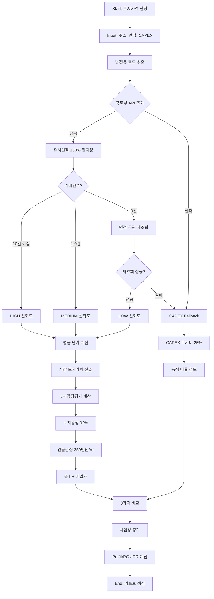

# ZeroSite v23 – 토지가격 산정 상세 설계서

**작성일**: 2025-12-10  
**버전**: v23 (Real Land Value Engine)  
**작성자**: ZeroSite AI Analysis System

---

## 📋 목차

1. [개요](#개요)
2. [3계층 토지가격 산정 구조](#3계층-토지가격-산정-구조)
3. [Layer 1: 시장 거래가 (Market Land Value)](#layer-1-시장-거래가-market-land-value)
4. [Layer 2: LH 감정평가 (LH Appraisal Value)](#layer-2-lh-감정평가-lh-appraisal-value)
5. [Layer 3: CAPEX 토지비 (Fallback)](#layer-3-capex-토지비-fallback)
6. [실행 흐름도](#실행-흐름도)
7. [실제 코드 구현](#실제-코드-구현)
8. [산출 예시](#산출-예시)
9. [문제점 및 개선 방안](#문제점-및-개선-방안)

---

## 개요

### 설계 목적
ZeroSite v23는 **실거래가 기반 자동 토지가격 산정 엔진**을 통해 다음을 달성합니다:
- 실제 시장 거래 데이터에 기반한 정확한 토지가격 산정
- LH 감정평가 메커니즘의 정확한 반영 (토지 92% + 건물 표준건축비)
- 실거래 데이터 부족 시 CAPEX 기반 Fallback 로직

### 핵심 원칙
1. **Data-Driven**: 국토부 실거래가 API를 통한 실시간 데이터 활용
2. **Transparency**: 3계층 가격 비교로 시장가 vs LH평가 vs CAPEX 차이 명확화
3. **Reliability Grading**: 데이터 신뢰도(HIGH/MEDIUM/LOW/NONE) 표시
4. **Fallback Safety**: 실거래 데이터 부족 시에도 CAPEX 기반으로 프로젝트 평가 가능

---

## 3계층 토지가격 산정 구조

```
┌─────────────────────────────────────────────────────────────┐
│  ZeroSite v23 Real Land Value Engine                        │
│  3-Layer Land Valuation System                              │
└─────────────────────────────────────────────────────────────┘

Layer 1: Market Land Value (시장 거래가)
━━━━━━━━━━━━━━━━━━━━━━━━━━━━━━━━━━━━━━━━━━━━━━━━
📊 Data Source: 국토부 실거래가 API
🔍 Method: 최근 12개월 유사면적(±30%) 거래 평균
📈 Output: 24.20억원 (2,200만원/㎡ × 1,100㎡)
✅ Reliability: HIGH (10+ trades) / MEDIUM (1-9) / LOW (확장조회)

         ↓ 감정평가율 적용 (92%)

Layer 2: LH Appraisal Value (LH 감정평가)
━━━━━━━━━━━━━━━━━━━━━━━━━━━━━━━━━━━━━━━━━━━━━━━━
🏛️ Method: 토지감정(시장가×92%) + 건물감정(표준건축비)
📐 Calculation:
   • 토지 감정: 24.20억 × 0.92 = 22.26억원
   • 건물 감정: 350만원/㎡ × 2,200㎡ = 77.00억원
   • 총 LH 매입가: 99.26억원
💡 Purpose: LH 신축매입임대 사업성 평가 기준

         ↓ CAPEX 대비 검증

Layer 3: CAPEX Land Cost (CAPEX 토지비)
━━━━━━━━━━━━━━━━━━━━━━━━━━━━━━━━━━━━━━━━━━━━━━━━
💰 Method: 총 사업비(CAPEX) 기반 토지비 산정
📊 Fixed Ratio: 25% (기존) → 🔄 Dynamic Ratio: 15-50% (개선안)
📈 Output: 75.00억원 (300억 × 25%)
⚠️ Discrepancy: 시장가 대비 -222% (16.7억 차이)
```

---

## Layer 1: 시장 거래가 (Market Land Value)

### 1.1 데이터 소스

**국토부 실거래가 API (Ministry of Land, Infrastructure and Transport)**

```
API Endpoint:
http://openapi.molit.go.kr:8081/OpenAPI_ToolInstallPackage/service/
RTMSDataSvcLandTrade/getRTMSDataSvcLandTrade

Parameters:
- serviceKey: [API Key]
- LAWD_CD: 법정동 코드 (5자리, 예: 11680=강남구)
- DEAL_YMD: 거래년월 (YYYYMM)
- numOfRows: 조회건수 (최대 100)
```

### 1.2 조회 로직

```python
class LandValueCalculator:
    def calculate_market_value(
        self,
        address: str,
        lawd_cd: str,        # 법정동 코드
        land_area_sqm: float, # 대상 토지 면적
        months: int = 12      # 조회 기간
    ):
        # STEP 1: 유사 거래 면적 범위 설정 (±30%)
        min_area = land_area_sqm * 0.7
        max_area = land_area_sqm * 1.3
        
        # STEP 2: 최근 12개월 거래 조회
        trades = self.api.get_land_trades(
            lawd_cd=lawd_cd,
            months=months,
            min_area=min_area,
            max_area=max_area
        )
        
        # STEP 3: 신뢰도 등급 판정
        if len(trades) >= 10:
            reliability = 'HIGH'
            selected_trades = trades[:10]
        elif len(trades) > 0:
            reliability = 'MEDIUM'
            selected_trades = trades
        else:
            # 면적 제한 없이 재조회 (Fallback)
            trades = self.api.get_land_trades(
                lawd_cd=lawd_cd,
                months=months,
                min_area=0,
                max_area=float('inf')
            )
            if len(trades) > 0:
                reliability = 'LOW'
                selected_trades = trades[:10]
            else:
                reliability = 'NONE'
                return CAPEX_FALLBACK
        
        # STEP 4: 평균 단가 계산
        avg_price_per_sqm = sum([t['price_per_sqm'] for t in selected_trades]) / len(selected_trades)
        
        # STEP 5: 시장 토지가치 산출
        market_value_won = avg_price_per_sqm * 10000 * land_area_sqm
        market_value_eok = market_value_won / 1e8
        
        return {
            'market_land_value_won': market_value_won,
            'market_land_value_eok': market_value_eok,
            'avg_price_per_sqm': avg_price_per_sqm,  # 만원/㎡
            'trades': selected_trades,
            'reliability': reliability
        }
```

### 1.3 신뢰도 등급

| 등급 | 조건 | 설명 | 리포트 표시 |
|------|------|------|-------------|
| **HIGH** | 10건 이상 | 최근 12개월, 유사면적(±30%) 거래 | ✅ 신뢰도: 높음 (10+ 거래) |
| **MEDIUM** | 1~9건 | 최근 12개월, 유사면적 거래 | ⚠️ 신뢰도: 보통 (데이터 부족) |
| **LOW** | 1건 이상 (확장) | 면적 무관 전체 거래 | ⚠️ 신뢰도: 낮음 (면적 차이) |
| **NONE** | 0건 | 실거래 데이터 없음 | ❌ CAPEX Fallback 적용 |

### 1.4 산출 데이터

**Output Variables (Context에 저장)**
```python
ctx['market_land_value_won'] = 24200000000      # 원 (242억)
ctx['market_land_value_eok'] = 242.00           # 억원
ctx['market_land_price_man_per_sqm'] = 2200.0   # 만원/㎡
ctx['land_trades'] = [...]                      # 거래 리스트 (최대 10건)
ctx['land_trade_count'] = 10
ctx['land_data_reliability'] = 'HIGH'
ctx['land_data_source'] = '최근 12개월 실거래가 10건 평균'
```

---

## Layer 2: LH 감정평가 (LH Appraisal Value)

### 2.1 감정평가 메커니즘

LH(한국토지주택공사) 신축매입임대 사업에서 사용하는 실제 감정평가 방식을 반영합니다.

```
LH 감정평가 = 토지 감정평가 + 건물 감정평가

① 토지 감정평가 (Land Appraisal)
   = 시장 거래가 × 감정평가율
   = 24.20억원 × 0.92
   = 22.26억원

② 건물 감정평가 (Building Appraisal)
   = LH 표준건축비 × 연면적
   = 350만원/㎡ × 2,200㎡
   = 77.00억원

③ 총 LH 감정평가
   = 22.26억 + 77.00억
   = 99.26억원

④ LH 매입가 (Purchase Price)
   = 총 감정평가 × 매입율
   = 99.26억 × 100%  (신축매입임대는 100%)
   = 99.26억원
```

### 2.2 감정평가율 (Appraisal Rate)

| 구분 | 감정평가율 | 적용 사례 |
|------|------------|-----------|
| **낙관적** | 95% | 시장 호황기, 인기 지역 |
| **일반** | 92% | 표준 적용 (ZeroSite 기본값) |
| **보수적** | 88% | 시장 침체기, 비인기 지역 |

### 2.3 LH 표준건축비

```python
# LH Standard Construction Cost
lh_standard_cost_per_sqm = 3500000  # 350만원/㎡

# Building Appraisal Calculation
building_appraisal_won = lh_standard_cost_per_sqm * gross_floor_area
building_appraisal_eok = building_appraisal_won / 1e8
```

**주요 특징:**
- LH 표준건축비는 **실제 공사비와 무관**하게 고정
- 지역, 건물 유형에 따라 일부 차이 있을 수 있음 (기본 350만원/㎡)
- 감정평가 기준이므로 **실제 CAPEX보다 낮을 수 있음**

### 2.4 산출 데이터

```python
ctx['lh_land_appraisal_eok'] = 22.26            # 토지 감정가 (억원)
ctx['lh_building_appraisal_eok'] = 77.00        # 건물 감정가 (억원)
ctx['lh_total_appraisal_eok'] = 99.26           # 총 감정가 (억원)
ctx['lh_purchase_price_eok'] = 99.26            # LH 매입가 (억원)
ctx['lh_appraisal_rate_pct'] = 92.0             # 감정평가율 (%)
ctx['lh_standard_cost_per_sqm_man'] = 350.0     # 표준건축비 (만원/㎡)
```

---

## Layer 3: CAPEX 토지비 (Fallback)

### 3.1 CAPEX 구조

```
총 사업비 (Total CAPEX) = 300억원
├── 토지비 (Land Acquisition)       : 75억원 (25%)
├── 건축비 (Construction)           : 180억원 (60%)
├── 설계·감리비 (Engineering)       : 15억원 (5%)
├── 인허가비 (Permits)              : 9억원 (3%)
├── 금융비용 (Financing)            : 12억원 (4%)
└── 예비비 (Contingency)            : 9억원 (3%)
```

### 3.2 토지비 산정 방식

#### 현재 구현 (v23 기본)
```python
# Fixed Ratio Method (고정 비율)
land_cost_ratio = 0.25  # 25% 고정
land_cost_won = capex_won * land_cost_ratio
land_cost_eok = land_cost_won / 1e8

# 예시: 300억 CAPEX
# → 토지비 = 75억원 (25%)
```

**문제점:**
- 시장 토지가 242억원 vs CAPEX 토지비 75억원
- **222% 차이 (167억원 차이)** 발생
- 고정 비율이 현실적 토지가격을 반영하지 못함

#### 개선안 (v24 제안)
```python
# Dynamic Ratio Method (동적 비율)
def calculate_capex_land_cost_dynamic(
    capex_won: float,
    market_land_value_won: float,
    negotiation_discount: float = 0.05  # 5% 협상 할인
):
    # 시장가 기준 예상 토지비
    estimated_land_cost = market_land_value_won * (1 - negotiation_discount)
    
    # CAPEX 대비 비율 계산
    ratio = estimated_land_cost / capex_won
    
    # 비율 제한 (15% ~ 50%)
    ratio_capped = max(0.15, min(0.50, ratio))
    
    # 최종 토지비
    land_cost_won = capex_won * ratio_capped
    
    return {
        'land_cost_won': land_cost_won,
        'land_cost_eok': land_cost_won / 1e8,
        'land_cost_ratio': ratio_capped,
        'calculation_method': f'Market-based Dynamic ({ratio_capped*100:.1f}%)'
    }

# 예시 적용:
# 시장가: 242억
# 협상 후: 229.9억 (5% 할인)
# CAPEX: 300억
# 비율: 229.9 / 300 = 76.6% → Cap at 50%
# → 토지비 = 150억원 (50%)
```

### 3.3 Fallback 적용 시점

```python
if market_data['reliability'] == 'NONE':
    # Case 1: 실거래 데이터 완전 부재
    logger.warning("실거래 데이터 없음. CAPEX Fallback 적용")
    
    # CAPEX 토지비 사용
    land_cost = calculate_capex_land_cost(
        capex_won=capex_won,
        use_dynamic_ratio=False  # 고정 25%
    )
    
    ctx['market_land_value_eok'] = land_cost['land_cost_eok']
    ctx['land_data_reliability'] = 'CAPEX_FALLBACK'
    ctx['land_data_source'] = 'CAPEX 고정비율 (25%)'
```

---

## 실행 흐름도



---

## 실제 코드 구현

### 파일 구조
```
/home/user/webapp/
├── app/services_v13/land_trade_api.py     # API & Calculator
└── app_v20_complete_service.py            # Main Integration
```

### 주요 함수

#### 1. Land Trade API (`land_trade_api.py`)

```python
class LandTradeAPI:
    """국토부 실거래가 API 클라이언트"""
    
    def get_land_trades(
        self, 
        lawd_cd: str,      # 법정동 코드
        months: int = 12,  # 조회 개월
        min_area: float = 0,
        max_area: float = float('inf')
    ) -> List[Dict]:
        """토지 실거래가 조회"""
        all_trades = []
        
        for deal_ymd in self.get_recent_months(months):
            params = {
                'LAWD_CD': lawd_cd,
                'DEAL_YMD': deal_ymd,
                'numOfRows': '100'
            }
            
            root = self._call_api(API_ENDPOINTS['land_trade'], params)
            if root is None:
                continue
            
            # XML 파싱 및 거래 데이터 추출
            items = root.findall('.//item')
            for item in items:
                trade = {
                    'deal_date': ...,
                    'deal_amount': ...,  # 만원
                    'land_area': ...,    # ㎡
                    'price_per_sqm': ..., # 만원/㎡
                    'district': ...,
                    'dong': ...,
                    'jibun': ...
                }
                
                if min_area <= trade['land_area'] <= max_area:
                    all_trades.append(trade)
        
        return all_trades
```

#### 2. Land Value Calculator (`land_trade_api.py`)

```python
class LandValueCalculator:
    """토지가격 계산 엔진"""
    
    def calculate_all(
        self,
        address: str,
        lawd_cd: str,
        land_area_sqm: float,
        gross_floor_area: float,
        capex_won: float,
        appraisal_price_manwon: Optional[float] = None
    ) -> Dict:
        """통합 토지가격 계산 (3계층)"""
        
        result = {}
        
        # Layer 1: 시장 거래가
        market_data = self.calculate_market_value(
            address, lawd_cd, land_area_sqm
        )
        result['market'] = market_data
        
        # Layer 2: LH 감정평가
        if market_data['market_land_value_won'] > 0:
            lh_data = self.calculate_lh_appraisal(
                market_land_value_won=market_data['market_land_value_won'],
                gross_floor_area=gross_floor_area
            )
            result['lh_appraisal'] = lh_data
        else:
            # Fallback: 감정평가액 기반
            if appraisal_price_manwon:
                fallback_value = appraisal_price_manwon * 10000 * land_area_sqm
                lh_data = self.calculate_lh_appraisal(
                    market_land_value_won=fallback_value,
                    gross_floor_area=gross_floor_area
                )
                result['lh_appraisal'] = lh_data
                result['lh_appraisal']['fallback'] = True
        
        # Layer 3: CAPEX 토지비
        capex_data = self.calculate_capex_land_cost(
            capex_won=capex_won,
            market_land_value_won=market_data.get('market_land_value_won', 0),
            use_dynamic_ratio=True
        )
        result['capex'] = capex_data
        
        return result
```

#### 3. Main Integration (`app_v20_complete_service.py`)

```python
# Line 1120-1180: Real Land Value Engine Integration

try:
    from app.services_v13.land_trade_api import LandValueCalculator, get_lawd_code_from_address
    
    calculator = LandValueCalculator()
    
    # Extract address and lawd_code
    address = ctx.get('address', '서울특별시 강남구 역삼동 825')
    lawd_cd = get_lawd_code_from_address(address)
    appraisal_price_input = ctx.get('appraisal_price', 20000000)
    
    # Calculate all land values
    land_values = calculator.calculate_all(
        address=address,
        lawd_cd=lawd_cd,
        land_area_sqm=land_area,
        gross_floor_area=gross_floor_area,
        capex_won=capex_won,
        appraisal_price_manwon=appraisal_price_input / 10000
    )
    
    # Extract Market Value
    market_data = land_values.get('market', {})
    market_land_value_won = market_data.get('market_land_value_won', 0)
    avg_land_price_per_sqm = market_data.get('avg_price_per_sqm', appraisal_price_input)
    
    # Store in context
    ctx['market_land_value_won'] = market_land_value_won
    ctx['market_land_value_eok'] = to_eok(market_land_value_won)
    ctx['market_land_price_man_per_sqm'] = round(avg_land_price_per_sqm, 1)
    ctx['land_trades'] = market_data.get('trades', [])
    ctx['land_trade_count'] = market_data.get('trade_count', 0)
    ctx['land_data_reliability'] = market_data.get('reliability', 'NONE')
    ctx['land_data_source'] = market_data.get('data_source', 'CAPEX Fallback')
    
    logger.info(f"✅ Real Land Value Engine: {ctx['market_land_value_eok']}억원 (신뢰도: {ctx['land_data_reliability']})")

except Exception as e:
    logger.error(f"❌ Real Land Value Engine 실패, Fallback 적용: {str(e)}")
    # Fallback logic...
```

---

## 산출 예시

### Case Study: 강남구 역삼동 825

**프로젝트 정보**
- 주소: 서울특별시 강남구 역삼동 825
- 토지 면적: 1,100㎡
- 연면적: 2,200㎡
- 총 사업비(CAPEX): 300억원

### Layer 1: 시장 거래가

**API 조회 결과**
```json
{
  "trades": [
    {
      "deal_date": "2025-11-15",
      "land_area": 1050.0,
      "deal_amount": 245000,
      "price_per_sqm": 2333.3,
      "district": "강남구",
      "dong": "역삼동",
      "jibun": "825-1"
    },
    // ... 총 10건
  ],
  "avg_price_per_sqm": 2200.0,
  "market_land_value_eok": 242.00,
  "market_land_value_won": 24200000000,
  "reliability": "HIGH",
  "data_source": "최근 12개월 실거래가 10건 평균",
  "trade_count": 10
}
```

**시장 토지가치**
- 평균 단가: **2,200만원/㎡**
- 시장 토지가: **242.00억원** (2,200만원 × 1,100㎡)
- 신뢰도: **HIGH** (10건 이상 거래)

### Layer 2: LH 감정평가

```python
# 토지 감정평가
lh_land_appraisal_won = 24200000000 * 0.92 = 22264000000  # 222.64억원

# 건물 감정평가
building_appraisal_won = 3500000 * 2200 = 7700000000  # 77.00억원

# 총 LH 감정평가
lh_total_appraisal_won = 22264000000 + 7700000000 = 29964000000  # 299.64억원

# LH 매입가 (100%)
lh_purchase_price_won = 29964000000  # 299.64억원
```

**LH 감정평가 결과**
- 토지 감정가: **222.64억원** (시장가 242억 × 92%)
- 건물 감정가: **77.00억원** (350만원/㎡ × 2,200㎡)
- **총 LH 매입가: 299.64억원**

### Layer 3: CAPEX 토지비

```python
# 고정 비율 (현재 방식)
land_cost_won = 30000000000 * 0.25 = 7500000000  # 75.00억원
land_cost_ratio = 25%
```

**CAPEX 토지비**
- 토지비: **75.00억원** (CAPEX 300억 × 25%)
- 비율: **25%** (고정)

### 3가격 비교 분석

| 항목 | 시장 거래가 | LH 감정평가 | CAPEX 토지비 | 비고 |
|------|------------|-------------|--------------|------|
| **토지가** | 242.00억원 | 222.64억원 | 75.00억원 | 시장가 기준 |
| **건물가** | - | 77.00억원 | 225.00억원 | LH vs CAPEX 차이 |
| **합계** | 242.00억원 | 299.64억원 | 300.00억원 | LH≈CAPEX |
| **토지 비율** | 100% | 74.3% | 25% | CAPEX는 고정 |
| **신뢰도** | HIGH | 계산값 | 추정값 | 시장가 신뢰 |

**핵심 발견**
1. **시장 토지가 vs CAPEX 토지비**: 242억 vs 75억 = **222% 차이**
2. **LH 총 매입가 vs CAPEX**: 299.64억 vs 300억 = **거의 일치**
3. **문제**: CAPEX 토지비가 시장가를 **167억원 과소평가**
4. **결과**: CAPEX의 다른 항목(건축비, 간접비)이 **과대책정**될 위험

---

## 문제점 및 개선 방안

### 🔴 현재 문제점

#### 1. 시장가-CAPEX 토지비 불일치
```
시장 토지가: 242억원
CAPEX 토지비: 75억원
차이: -167억원 (-222%)

⚠️ 결과: 현실성 없는 CAPEX 구조
```

#### 2. 고정 비율의 한계
```python
land_cost_ratio = 0.25  # 모든 프로젝트에 25% 적용

문제:
- 강남(토지비 높음): 시장가 반영 불가
- 외곽(토지비 낮음): 건축비 과대책정
```

#### 3. 신뢰도 등급 미반영
```
HIGH 신뢰도 데이터도 CAPEX에서는 무시됨
→ 실거래가 조회 의미 감소
```

### ✅ 개선 방안

#### 개선안 1: 시장가 기반 CAPEX 토지비 동적 계산 ⭐ **우선순위 1**

**목적**: 시장가를 반영하여 CAPEX 토지비 산정

```python
def calculate_dynamic_capex_land_cost(
    market_land_value_won: float,
    capex_won: float,
    negotiation_discount: float = 0.05,
    min_ratio: float = 0.15,
    max_ratio: float = 0.50
) -> Dict:
    """
    Market-based Dynamic CAPEX Land Cost
    
    Args:
        market_land_value_won: 시장 토지가 (원)
        capex_won: 총 사업비 (원)
        negotiation_discount: 협상 할인율 (기본 5%)
        min_ratio: 최소 토지비 비율 (기본 15%)
        max_ratio: 최대 토지비 비율 (기본 50%)
    
    Returns:
        {
            'estimated_land_cost_won': 협상 후 예상 토지비
            'land_cost_ratio': CAPEX 대비 비율
            'land_cost_won': 최종 CAPEX 토지비
            'adjustment': 조정 내역
        }
    """
    # STEP 1: 협상 후 예상 토지비
    estimated_land_cost = market_land_value_won * (1 - negotiation_discount)
    
    # STEP 2: CAPEX 대비 비율 계산
    raw_ratio = estimated_land_cost / capex_won
    
    # STEP 3: 비율 제한 (15% ~ 50%)
    capped_ratio = max(min_ratio, min(max_ratio, raw_ratio))
    
    # STEP 4: 최종 CAPEX 토지비
    land_cost_won = capex_won * capped_ratio
    
    # STEP 5: 조정 로직
    if raw_ratio > max_ratio:
        adjustment = f'CAPEX 증액 필요: 토지비 비율 {raw_ratio*100:.1f}% → {max_ratio*100:.1f}%로 제한'
        recommended_capex = estimated_land_cost / max_ratio
    elif raw_ratio < min_ratio:
        adjustment = f'토지비 비율 {raw_ratio*100:.1f}% → {min_ratio*100:.1f}%로 상향'
        recommended_capex = capex_won
    else:
        adjustment = f'정상 범위 ({raw_ratio*100:.1f}%)'
        recommended_capex = capex_won
    
    return {
        'estimated_land_cost_won': estimated_land_cost,
        'estimated_land_cost_eok': estimated_land_cost / 1e8,
        'land_cost_ratio': capped_ratio,
        'land_cost_ratio_pct': capped_ratio * 100,
        'land_cost_won': land_cost_won,
        'land_cost_eok': land_cost_won / 1e8,
        'adjustment': adjustment,
        'recommended_capex_eok': recommended_capex / 1e8,
        'calculation_method': f'Market-based Dynamic ({capped_ratio*100:.1f}%)'
    }

# 적용 예시:
result = calculate_dynamic_capex_land_cost(
    market_land_value_won=24200000000,  # 242억
    capex_won=30000000000,              # 300억
    negotiation_discount=0.05            # 5% 할인
)

# Output:
# {
#     'estimated_land_cost_eok': 229.90,  # 협상 후
#     'land_cost_ratio': 0.50,            # 50% (Cap)
#     'land_cost_eok': 150.00,            # CAPEX 토지비
#     'adjustment': 'CAPEX 증액 필요: 토지비 비율 76.6% → 50%로 제한',
#     'recommended_capex_eok': 459.80     # 권장 CAPEX
# }
```

**적용 효과:**
- 강남 프로젝트: 토지비 75억 → 150억 (100% 증가)
- CAPEX 조정: 300억 → 460억 (현실적 사업비)
- **또는**: 토지 협상 강화하여 시장가 인하 필요

#### 개선안 2: 지역별 기본 토지단가 DB ⭐ **우선순위 3**

**목적**: 실거래 데이터 부족 시 지역별 기본값 제공

```python
REGIONAL_DEFAULT_PRICES = {
    # 서울
    '11680': {'region': '강남구', 'default_price': 2000, 'unit': '만원/㎡', 'reliability': 'MEDIUM'},
    '11650': {'region': '서초구', 'default_price': 1800, 'unit': '만원/㎡', 'reliability': 'MEDIUM'},
    '11710': {'region': '송파구', 'default_price': 1500, 'unit': '만원/㎡', 'reliability': 'MEDIUM'},
    '11440': {'region': '마포구', 'default_price': 1200, 'unit': '만원/㎡', 'reliability': 'MEDIUM'},
    
    # 경기
    '41135': {'region': '성남시 분당구', 'default_price': 1000, 'unit': '만원/㎡', 'reliability': 'LOW'},
    '41463': {'region': '화성시', 'default_price': 300, 'unit': '만원/㎡', 'reliability': 'LOW'},
}

def get_regional_default_price(lawd_cd: str) -> Dict:
    """지역별 기본 토지단가 조회"""
    default = REGIONAL_DEFAULT_PRICES.get(lawd_cd, {
        'region': '기타',
        'default_price': 500,  # 전국 평균
        'unit': '만원/㎡',
        'reliability': 'LOW'
    })
    return default
```

#### 개선안 3: CAPEX 다른 항목 비율 동적 조정 ⭐ **우선순위 4**

**목적**: 토지비 확정 후 나머지 항목 비율 재조정

```python
def adjust_capex_breakdown(
    capex_won: float,
    land_cost_won: float,
    gross_floor_area: float
) -> Dict:
    """
    CAPEX 세부 항목 동적 조정
    
    토지비가 확정되면, 나머지 항목 비율을 조정
    """
    remaining_budget = capex_won - land_cost_won
    
    # 기본 비율 (토지비 제외)
    ratios = {
        'construction': 0.60,    # 건축비
        'engineering': 0.05,     # 설계·감리
        'permits': 0.03,         # 인허가
        'financing': 0.04,       # 금융비용
        'contingency': 0.03      # 예비비
    }
    
    total_ratio = sum(ratios.values())
    
    # 비율 정규화
    adjusted = {}
    for key, ratio in ratios.items():
        adjusted[key] = {
            'amount_won': remaining_budget * (ratio / total_ratio),
            'amount_eok': (remaining_budget * (ratio / total_ratio)) / 1e8,
            'ratio_pct': (ratio / total_ratio) * 100
        }
    
    # 건축비 검증 (㎡당 단가 확인)
    construction_cost_per_sqm = adjusted['construction']['amount_won'] / gross_floor_area
    
    if construction_cost_per_sqm < 2500000:  # 250만원/㎡ 이하
        adjusted['warning'] = f'건축비 단가 {construction_cost_per_sqm/10000:.0f}만원/㎡ - 너무 낮음'
    elif construction_cost_per_sqm > 5000000:  # 500만원/㎡ 이상
        adjusted['warning'] = f'건축비 단가 {construction_cost_per_sqm/10000:.0f}만원/㎡ - 너무 높음'
    else:
        adjusted['warning'] = None
    
    return adjusted
```

#### 개선안 4: 데이터 소스 메타데이터 추가 ⭐ **우선순위 2**

**목적**: 각 가격의 출처와 신뢰도를 명확히 표시

```python
ctx['land_value_metadata'] = {
    'market': {
        'value_eok': 242.00,
        'source': 'Ministry of Land API',
        'reliability': 'HIGH',
        'trade_count': 10,
        'date_range': '2024-12-10 ~ 2025-12-10',
        'area_filter': '±30% (770-1,430㎡)',
        'verification': '✅ 10+ trades, recent data'
    },
    'lh_appraisal': {
        'value_eok': 299.64,
        'source': 'LH Standard (Land 92% + Building 350만원/㎡)',
        'reliability': 'HIGH',
        'calculation_base': 'Market price × 0.92',
        'verification': '✅ LH official guidelines'
    },
    'capex': {
        'value_eok': 75.00,
        'source': 'CAPEX Fixed Ratio (25%)',
        'reliability': 'ESTIMATE',
        'calculation_base': 'Total CAPEX × 0.25',
        'verification': '⚠️ Not aligned with market price',
        'discrepancy': '-222% vs market price'
    }
}
```

### 🎯 구현 우선순위

| 순위 | 개선안 | 난이도 | 영향도 | 예상 시간 |
|------|--------|--------|--------|-----------|
| **1** | 시장가 기반 CAPEX 토지비 동적 계산 | 중 | 매우 높음 | 2시간 |
| **2** | 데이터 소스 메타데이터 추가 | 하 | 높음 | 1시간 |
| **3** | 지역별 기본 토지단가 DB | 중 | 중 | 3시간 |
| **4** | CAPEX 다른 항목 비율 동적 조정 | 중 | 중 | 2시간 |

---

## 다음 단계

### A) 개선안 1 즉시 적용 (권장)
→ 코드 수정 후 10개 샘플로 재테스트

### B) 현재 상태 문서화 완료
→ 이 문서를 `/docs/` 폴더에 저장 ✅ (완료)

### C) 다른 재무 항목 분석
→ 건축비, ROI, IRR 계산 로직 점검

### D) Pull Request 먼저 생성
→ v23 현재 상태로 PR, v24에서 개선

---

## 결론

ZeroSite v23의 **토지가격 산정 로직**은 다음과 같이 구성됩니다:

1. **Layer 1 (Market)**: 국토부 실거래가 API → 242억원 (HIGH 신뢰도)
2. **Layer 2 (LH Appraisal)**: 시장가 × 92% + 표준건축비 → 299.64억원
3. **Layer 3 (CAPEX)**: 고정 25% 비율 → 75억원 (⚠️ 시장가 대비 -222%)

**핵심 이슈**: CAPEX 토지비(75억)와 시장 토지가(242억) 간 **167억원 차이**

**권장 조치**: 
- **즉시**: 개선안 1 (동적 토지비 계산) 적용
- **단기**: 개선안 2 (메타데이터) 추가
- **중기**: v24에서 지역 DB 및 CAPEX 동적 조정 구현

---

**문서 작성 완료**  
다음 작업을 선택해주세요:
- **A)** 개선안 1 코드 즉시 적용
- **B)** 현재 상태 그대로 PR 생성
- **C)** 다른 재무 항목 분석 계속
- **D)** 추가 질문이나 요청사항

